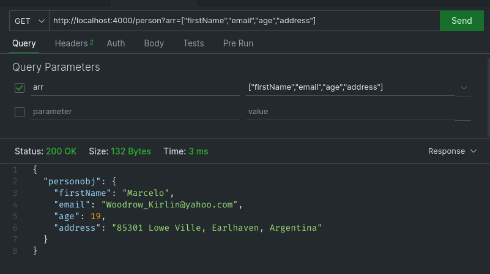

> # Assignment - 01

---

- [Problem-1](#problem-1)

- [Problem-2](#problem-2)

- [Problem-3](#problem-3)

---

## Problem-1

We have a function that can take two arguments called start and end. Both arguments will be a valid integer number. The function will return a random value in the given range.

## Solution:

- ### Output [Random Value](https://github.com/Mr-Anik1/BackendAssignment/blob/master/1.Assignment_1/src/appLogics/randomValue.js)

## Problem-2

We have a function that can generate a fake person profile including first name, last name, email, avatar, age and address. User can pass an array of selected properties and it will return a person object containing only given properties. Ex: generatePerson([’firstName’, ‘lastName’, ‘email’])

## Solution:

- ### Output [Person Object](https://github.com/Mr-Anik1/BackendAssignment/blob/master/1.Assignment_1/src/appLogics/newPersonObj.js)

**Output-1**

**Output-2**

## Problem-3

We have a function that can accept a string as an argument and return an object containing the number of letters, number of symbols and number of numeric characters.

## Solution:

- ### Output [String Object](https://github.com/Mr-Anik1/BackendAssignment/blob/master/1.Assignment_1/src/appLogics/stringCount.js)

